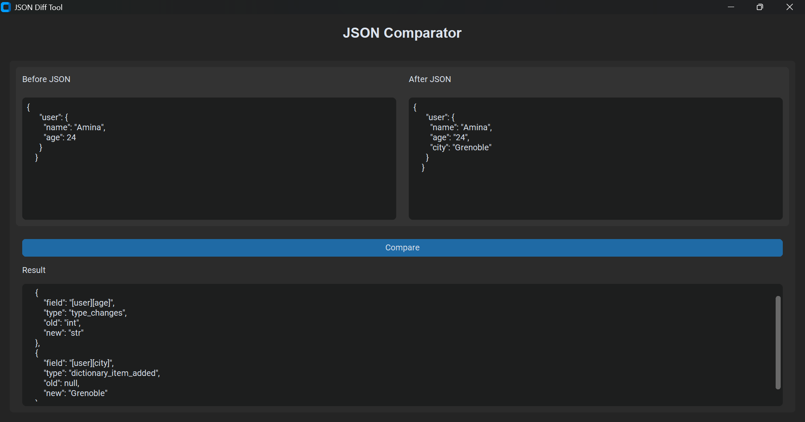

# JSONDiffTool

JSONDiffTool is a Python application designed to compare two JSON states, detect updated fields, and help analyze how data changes after a user action.

## Context

This project comes from a real need observed during an internship involving API integration and reverse-engineering of an existing web application.

During testing and debugging phases, it was often necessary to compare JSON API responses before and after a user action in order to identify impacted fields and understand how data evolved through application workflows.

At first, this need was partially covered with Bash scripts:
- one script to compare a **before** state and an **after** state,
- one script to track the evolution of detected fields across multiple tests.

JSONDiffTool is the Python version of this idea, with a cleaner structure, a more maintainable architecture, and a graphical interface.

The objective is to build a practical developer tool focused on readability, debugging, and analysis workflows rather than a simple academic comparison project.

## Main goal

The main objective of this project is to provide a simple tool that can:

- compare two JSON contents,
- detect changed, added, removed, or type-changed fields,
- display differences clearly,
- help analyze API behavior during testing scenarios,
- export results if needed.

## V1 scope

The first version focuses on:

- a simple graphical interface,
- two input areas for pasting JSON content,
- comparison of a **before** JSON and an **after** JSON,
- direct display of differences in the interface,
- optional CSV export of comparison results.

## Interface prototype

The interface shown below is an early visual prototype used to explore how JSON differences could be displayed in a clearer way.

The comparison logic is already based on DeepDiff. The current work focuses on building the graphical interface and improving my use of tkinter step by step.

## Example

Before:

    {
      "user": {
        "name": "Amina",
        "age": 24
      }
    }

After:

    {
      "user": {
        "name": "Amina",
        "age": "24",
        "city": "Grenoble"
      }
    }

Detected differences:

    [
      {
          "field": "[user][age]",
          "type": "type_changes",
          "old": "int",
          "new": "str"
      },
      {
          "field": "[user][city]",
          "type": "dictionary_item_added",
          "old": null,
          "new": "Grenoble"
      }
    ]

## Recent changes

- Kept the learning comparator in `app/core/custom_comparator.py`
- Project is progressively moving toward the main `app/core/deepdiff_comparator.py` implementation

## Planned improvements

Future versions may include:

- loading JSON files directly from the interface,
- tracking impacted fields across complete testing scenarios,
- API workflow integration to automatically collect GET and PUT responses from the target system,
- automatic before/after comparison after a user action,
- search for a specific field,
- comparison history.

## Expected difference format

Each detected difference should contain at least:

- `field`
- `type`
- `old`
- `new`

Handled change types in V1:

- `modified`
- `added`
- `removed`
- `type_changes`

## Project structure

    JSONDiffTool/
    ├── app/
    │   ├── __init__.py
    │   ├── main.py
    │   ├── core/
    │   │   ├── __init__.py
    │   │   ├── custom_comparator.py
    │   │   └── deepdiff_comparator.py
    │   ├── ui/
    │   │   ├── __init__.py
    │   │   └── interface.py
    │   └── utils/
    │       ├── __init__.py
    │       └── json_loader.py 
    ├── docs/
    |   └── interface-prototype.png
    ├── tests/
    │   ├── __init__.py
    │   ├── test_custom_comparator.py
    │   └── test_deepdiff_comparator.py
    ├── README.md
    ├── requirements.txt
    └── .gitignore

## Tech stack

- Python
- tkinter for the interface
- DeepDiff for JSON comparison
- Pytest for testing

## Project status

V1 in progress.

## Notes

All example JSON files used in this repository are anonymized.